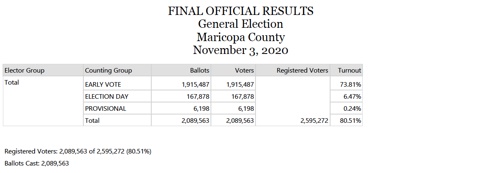
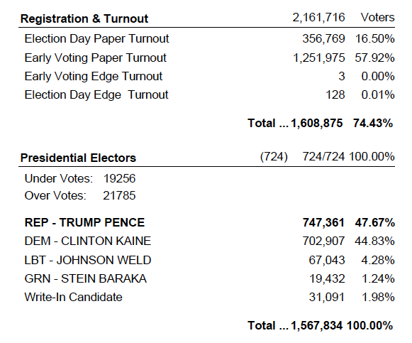

```{r, message = FALSE, }

library(tidyverse)
library(janitor)

```

Download data. Post election, the 2020 results are posted to [this page](https://recorder.maricopa.gov/electionresults/) and updated with each new release of official ballots. The link to the actual data, as of Nov. 13 at 4 p.m., is [here](https://recorder.maricopa.gov/media/ArizonaExportByPrecinct_110320.txt).

For the 2016 data, I downloaded the file from [this link](https://recorder.maricopa.gov/electionarchives/2016/11-08-2016%20Final%20Precinct%20Report%20NOV%202016.txt), available on the Maricopa County Recorder's election archives.

```{r, message = FALSE}

votes_by_precinct_2020 <- read_tsv( "ArizonaExportByPrecinct_110320.txt" ) %>% clean_names( )

votes_by_precinct_2016 <- read_tsv( "11-08-2016 Final Precinct Report NOV 2016.txt" ) %>% clean_names( )

```

Pull out tables specific to the presidential race, and registration.
```{r}

presidential_contest_2020 <- votes_by_precinct_2020 %>% 
  filter( contest_name == "Presidential Electors" ) %>% 
  distinct( precinct_id,
          precinct_name,
          candidate_name,
          registered,
          turnout,
          precinct_turnout,
          precinct_registered,
          votes,
          undervotes,
          overvotes ) %>% 
  group_by( precinct_id ) %>% 
  mutate( total_check = sum( votes ),
          total_check = total_check + undervotes + overvotes )
  
presidential_contest_2016 <- votes_by_precinct_2016 %>% 
  filter( contest_full_name == "Presidential Electors" ) %>% 
  select( precinct_id,
          precinct_name,
          candidate_full_name,
          contest_total,
          candidate_total = total,
          undervote,
          overvote )

```

In the 2020 file, I'm not sure whether to use the columns `precinct_turnout` or `precinct`, `precinct_registered` or `registered.` Here are some definitions from the Maricopa County Recorder's Office.

`precinct_registered`: Total registered voters from the main screen of the precinct record or in the case of a split
precinct the total registered voters from all splits. In the case of a split precinct this may not be
the same as the voters eligible for the specific contest on this record.

`registered`: Total registered voters for the contest and precinct on this record. It only includes registration
numbers for the specific splits containing the contest and/or the elector group (party)
containing the contest.

```{r}

presidential_contest_2020 %>% 
  distinct( precinct_id, 
            registered,
            turnout,
            precinct_registered,
            precinct_turnout
            ) %>% 
  ungroup( ) %>% 
  summarise(
    total_turnout = sum( turnout ),
    total_precinct_turnout = sum( precinct_turnout ),
    total_registered = sum( registered ),
    total_precinct_registered = sum( precinct_registered )
  )

```
These totals match the summary reports published by the county, so we should be good to use either set of columns!
 

Analyze undervotes. How many undervotes? Then find out if this corresponds AT ALL to flipped precincts.

Start with 2020.
```{r}

presidential_contest_2020 %>% 
  distinct( precinct_id, 
            registered,
            turnout,
            undervotes,
            overvotes
            ) %>% 
  ungroup( ) %>% 
  summarise( 
    total_turnout = sum( turnout ),
    total_registered = sum( registered ),
    total_undervotes = sum( undervotes ),
    total_overvotes = sum( overvotes )
    ) %>% 
  mutate( 
    pct_undervote = total_undervotes/total_turnout * 100,
    pct_overvote =  total_overvotes/total_turnout * 100 )


```

The figures above match the published totals by the Maricopa County Recorder's Office as of Friday, Nov. 13th. These were certified on Nov. 20, 2020.


Early votes in 2016. It's a slightly different file format than in 2020, so I'll pull out the registration numbers first.
``` {r, message = FALSE}

registration <- votes_by_precinct_2016 %>% 
  filter( contest_full_name == "Registration & Turnout" ) %>% 
  group_by( precinct_id ) %>% 
  summarise( total_registered = max( contest_total ) ) %>% 
  ungroup( ) %>% 
  summarise( 
    desc = "2016 summary",
    total_registered = sum( total_registered ) )

presidential_contest_2016 %>% 
  group_by( precinct_id ) %>% 
  # get distinct totals by precinct
  summarise( contest_total = max( contest_total ), # there were some irregularities in this column, which is why I've calculated the max
             undervote = max( undervote ),
             overvote = max( overvote ) ) %>% 
  ungroup( ) %>% 
  summarise( 
    desc = "2016 summary",
    total_turnout = sum( contest_total ),
    total_undervotes = sum( undervote ),
    total_overvotes = sum( overvote )
    ) %>% 
  left_join( registration ) %>% 
  select( -desc ) %>% 
  select(
    total_turnout,
    total_registered,
    total_undervotes,
    total_overvotes
  ) %>% 
  mutate(
    # sum of valid votes case with over/under votes
    total_turnout = total_turnout + total_overvotes + total_undervotes,
    pct_undervote = total_undervotes/total_turnout * 100,
    pct_overvote =  total_overvotes/total_turnout * 100
  )
  

```
The figures above match the published totals by the Maricopa County Recorder's Office in 2016.


It's still strange to me how much higher under/over votes are in 2016. Are there places that didn't vote in 2016 for president, but DID this year? Where were the biggest swings in turnout? And who did they vote for?

Build table with margin and party winner for every precinct. Start with 2020.

TO DO: Add margin as a percentage of turnout !!!!!!
TO DO: REMOVE FLIP analysis!
```{r}

president_by_precinct_2020 <- presidential_contest_2020 %>% 
  group_by( precinct_id, 
            registered,
            turnout,
            undervotes,
            overvotes
            ) %>% 
  arrange( 
    precinct_id, desc( votes )
    ) %>% 
  mutate( precinct_name = trimws( str_remove( precinct_name, "\\d{4}\\s" ) ),
          winning_votes = first( votes ),
          winning_candidate = first( candidate_name ),
          winning_party = case_when( winning_candidate == "BIDEN / HARRIS" ~ "DEM",
                               winning_candidate == "TRUMP / PENCE" ~ "REP",
                               winning_candidate == "JORGENSEN / COHEN" ~ "LIB" ),
          runner_up = lead( votes, 1, order_by = desc( votes ) ) ) %>% 
  slice( 1 ) %>% 
  mutate( margin = winning_votes - runner_up,
          winning_candidate = if_else( margin == 0,
                                       "TIE",
                                       winning_candidate ),
          winning_party = if_else( margin == 0,
                                   "TIE",
                                   winning_party ) ) %>% 
  select( 
    -runner_up,
    -candidate_name,
    -votes,
    -precinct_registered,
    -precinct_turnout,
    -total_check ) %>% 
  filter( !is.na( precinct_id ) )


```

Repeat these steps for 2016.
```{r}

# precinct-level voter registration
registered_by_precinct_2016 <- votes_by_precinct_2016 %>% 
  filter( contest_full_name == "Registration & Turnout" ) %>% 
  group_by( precinct_id ) %>% 
  summarise( registered = max( contest_total ) )

# precinct-level voting totals
president_by_precinct_2016 <- presidential_contest_2016 %>% 
  rename(
    overvotes = overvote,
    undervotes = undervote,
    votes = candidate_total,
    candidate_name = candidate_full_name
  ) %>% 
  group_by( precinct_id, 
            undervotes,
            overvotes
            ) %>% 
  arrange( 
    precinct_id, desc( votes ) 
    ) %>% 
  mutate( precinct_name = trimws( str_remove( precinct_name, "\\d{4}\\s" ) ),
          turnout = contest_total + undervotes + overvotes,
          winning_votes = first( votes ),
          winning_candidate = first( candidate_name ),
          winning_party = case_when( winning_candidate == "DEM - CLINTON KAINE" ~ "DEM",
                               winning_candidate == "REP - TRUMP PENCE" ~ "REP",
                               winning_candidate == "LBT - JOHNSON WELD" ~ "LIB" ),
          runner_up = lead( votes, 1, order_by = desc( votes ) ) )  %>% 
  slice( 1 ) %>% 
  mutate( margin = winning_votes - runner_up,
          winning_candidate = if_else( margin == 0,
                                       "TIE",
                                       winning_candidate ),
          winning_party = if_else( margin == 0,
                                   "TIE",
                                   winning_party ) ) %>% 
  filter( !is.na( precinct_id ) & contest_total != 0 ) %>% 
  left_join( registered_by_precinct_2016,
             by = c( "precinct_id" = "precinct_id" ) ) %>% 
  select(
    precinct_id,
    precinct_name,
    registered,
    turnout,
    undervotes,
    overvotes,
    winning_votes,
    winning_candidate,
    winning_party,
    margin
  )

```

CHECKS
```{r}

president_by_precinct_2020 %>%
  ungroup( ) %>% 
  summarise(
    turnout = sum( turnout ),
    registered = sum( registered ),
    overvotes = sum( overvotes ),
    undervotes = sum( undervotes )
  )

president_by_precinct_2016 %>%
  ungroup( ) %>% 
  summarise(
    turnout = sum( turnout ),
    registered = sum( registered ),
    overvotes = sum( overvotes ),
    undervotes = sum( undervotes )
  )


```

STORIES
1) Precinct 605. Two people voted and tied the precinct for Biden, Trump. Alternatively, the other precinct that tied: Layton Lakes (364)
2) Precincts with the highest turnout in 2020. 
3) Precincts where 100% of people voted by mail.

PRECINCTS THAT VOTED IN 2020 but not in 2016
```{r}

flip_check <- president_by_precinct_2020 %>% 
  left_join( president_by_precinct_2016, 
             #by = c( "precinct_id" = "precinct_id" ), # turns out you CAN'T join on ID. WONDERFUL.
             by = c( "precinct_name" = "precinct_name" ), # hypothesis
             suffix = c( "", "_16" ) ) %>% 
  mutate( 
    new_precinct = if_else( is.na( precinct_id_16 ), "Y", "N" ), 
    flip = if_else( winning_party != winning_party_16, "Y", "N" ) )

write.csv( flip_check, "maricopa_precinct_votes_president_2016_2020.csv")

```

Flipped precincts, by the numbers. Democrats won 61 out of 63 flipped precincts.
```{r}

flip_check %>% ungroup( ) %>% 
  summarise(
    total_flipped = sum( if_else( flip == "Y", 1, 0 ), na.rm = TRUE ),
    flip_to_dem = sum( if_else( flip == "Y" & winning_party == "DEM", 1, 0 ), 
                       na.rm = TRUE ),
    flip_to_rep = sum( if_else( flip == "Y" & winning_party == "REP", 1, 0 ), 
                       na.rm = TRUE ),
    tie = sum( if_else( flip == "Y" & winning_party == "TIE", 1, 0 ), 
               na.rm = TRUE )
    )

```

Now, I'll try to map these results in QGIS or ArcGIS. I downloaded the voting precinct shapefiles from the Maricopa County Recorder's Office at [this link](https://recorder.maricopa.gov/electionmaps/).

Precincts with highest turnout in 2020:
```{r}

president_by_precinct_2020 %>% 
  mutate( turnout_pct =  turnout/registered * 100 ) %>% 
  arrange( desc( turnout_pct ) )

```

