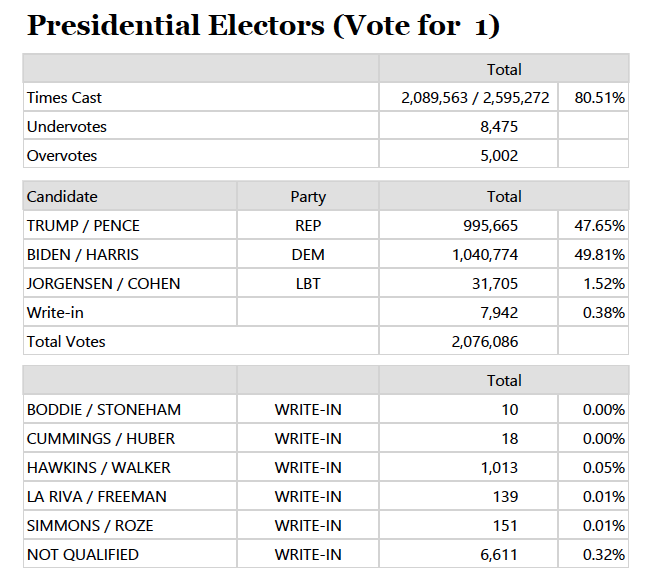
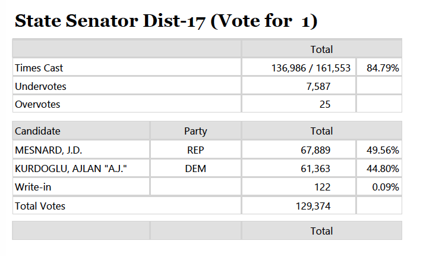
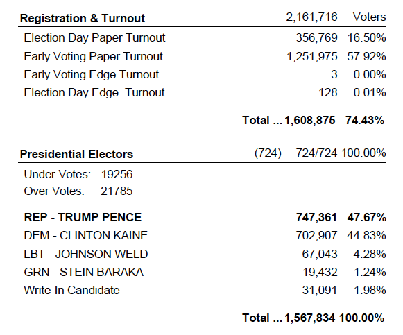

This document analayzes election data in Arizona's Maricopa County at the precinct-level. The findings were used to create an interactive map and to support a story for the Arizona Capitol Times. 

The focus on this project was the presidential race. Although I include some glimpses of the results by legislative district and a look at state senate results, the major work of this code is to produce precinct-level election results that show whether Joe Biden or President Donald Trump won the precinct and by how much.

```{r, message = FALSE, include = FALSE }

library(tidyverse)
library(janitor)
library(kableExtra)

```

## 2020 General Election

Download the 2020 election results from the [Maricopa County Recorder's Office](https://recorder.maricopa.gov/electionresults/) or use [this link](https://recorder.maricopa.gov/media/ArizonaExportByPrecinct_110320.txt) to access the results directly. 

These results were published as of Nov. 13 at 4 p.m. after all votes were counted. The results were [certified](https://www.azcentral.com/story/news/politics/elections/2020/11/20/maricopa-county-supervisors-meet-consider-certifying-election-results/6362991002/) on Nov. 20, 2020 by the Maricopa County Board of Supervisors.

```{r, message = FALSE}

votes_by_precinct_2020 <- read_tsv( "ArizonaExportByPrecinct_110320.txt" ) %>% clean_names( )

```

How many precincts should there be?
```{r}

votes_by_precinct_2020 %>% filter( !is.na( precinct_id ) ) %>% distinct( precinct_id ) %>% nrow( )

```

Pull out tables specific to the presidential race.
```{r}

presidential_contest_2020 <- votes_by_precinct_2020 %>% 
  filter( contest_name == "Presidential Electors" ) %>% 
  # IMPORTANT: filter for regular, write-in totals
  # without this, you would double-count all write-in votes
  filter( candidate_type == "R" | candidate_type == "W" ) %>% 
  distinct( precinct_id,
          precinct_name,
          registered,
          turnout,
          undervotes,
          overvotes,
          candidate_name,
          votes,
           ) %>% 
  mutate( precinct_name =  trimws( str_remove( precinct_name, "\\d{4}\\s" ) ) ) # remove ID from the precinct name
  
```

Check registration and turnout totals for 2020:
```{r}

presidential_contest_2020 %>% 
  distinct( precinct_id, 
            registered,
            turnout
            ) %>% 
  ungroup( ) %>% 
  summarise(
    total_turnout = sum( turnout ),
    total_registered = sum( registered )
  ) %>% 
  kable( )

```
These sums match the summary reports published by the county, so we should be good to go!
 

Next: Build table with margin and party winner for every precinct.
```{r}

president_by_precinct_2020 <- presidential_contest_2020 %>% 
  group_by( precinct_id, 
            registered,
            turnout,
            undervotes,
            overvotes
            ) %>% 
  arrange( 
    precinct_id, desc( votes )
    ) %>% 
  mutate( vote_total = sum( votes ), # NOTE: this is different from the turnout, because it excludes over/under votes
          winning_votes = first( votes ),
          winning_candidate = first( candidate_name ),
          winning_party = case_when( winning_candidate == "BIDEN / HARRIS" ~ "DEM",
                               winning_candidate == "TRUMP / PENCE" ~ "REP" ),
          runner_up = lead( votes, 1, order_by = desc( votes ) ) ) %>% 
  slice( 1 ) %>% 
  mutate( margin = winning_votes - runner_up,
          margin_pct = ( margin / vote_total ) * 100, # divide by VOTE TOTAL, not turnout
          winning_candidate = if_else( margin == 0,
                                       "TIE",
                                       winning_candidate ),
          winning_party = if_else( margin == 0,
                                   "TIE",
                                   winning_party ) ) %>% 
  select( 
    -runner_up,
    -candidate_name,
    -votes ) %>% 
  filter( !is.na( precinct_id ) )


```

CHECKS

Totals by vote type:
```{r}

president_by_precinct_2020 %>%
  ungroup( ) %>% 
  summarise(
    registered = sum( registered ),
    turnout = sum( turnout ),
    undervotes = sum( undervotes ),
    overvotes = sum( overvotes ),
    vote_total = sum( vote_total ),
  )

```

Totals by candidate:
```{r}

presidential_contest_2020 %>% 
  filter( candidate_name == "BIDEN / HARRIS" | candidate_name == "TRUMP / PENCE" ) %>% 
  group_by( candidate_name ) %>% 
  summarise( 
    votes = sum( votes ) ) %>% 
  arrange( desc( votes ) )

```

The figures above match the published totals by the Maricopa County Recorder's Office.



FOR THE STORY:

I want to know the 2020 margin in a handful of precincts east of Phoenix. These are all in state Legislative District 17; all chose Joe Biden.
```{r}

president_by_precinct_2020 %>% 
  filter( precinct_name %in% c( "GERMANN", "LANTANA CANYON", "DOBSON PARK", "LAREDO", "MUSKET" ) ) %>% 
  arrange( margin )

```

Save. These are the results that will be loaded into an interactive map.
```{r}

write.csv( president_by_precinct_2020, "maricopa_precinct_votes_president_2020.csv" )

```

### Legislative District 17 senate race

Repeat the same steps for the state senate race in District 17. First, pull out all senate results in LD17.
```{r}

senate_contest_2020 <- votes_by_precinct_2020 %>% 
  filter( contest_name == "State Senator Dist-17" ) %>% 
  # IMPORTANT: regular, write-in totals
  # without this, you would double-count all write-in votes
  filter( candidate_type == "R" | candidate_type == "W" ) %>% 
  distinct( precinct_id,
          precinct_name,
          registered,
          turnout,
          undervotes,
          overvotes,
          candidate_name,
          votes,
           ) %>% 
  mutate( precinct_name =  trimws( str_remove( precinct_name, "\\d{4}\\s" ) ) ) # remove ID from the precinct name

```

Compile winner by precinct:
```{r}

senate_by_precinct_2020 <- senate_contest_2020 %>% 
  group_by( precinct_id, 
            registered,
            turnout,
            undervotes,
            overvotes
            ) %>% 
  arrange( 
    precinct_id, desc( votes )
    ) %>% 
  mutate( vote_total = sum( votes ), # NOTE: this is different from the turnout, because it excludes over/under votes
          winning_votes = first( votes ),
          winning_candidate = first( candidate_name ),
          winning_party = case_when( winning_candidate == 'KURDOGLU, AJLAN "A.J."' ~ "DEM",
                               winning_candidate == "MESNARD, J.D." ~ "REP" ),
          runner_up = lead( votes, 1, order_by = desc( votes ) ) ) %>% 
  slice( 1 ) %>% 
  mutate( margin = winning_votes - runner_up,
          margin_pct = ( margin / vote_total ) * 100, # divide by VOTE TOTAL, not turnout
          winning_candidate = if_else( margin == 0,
                                       "TIE",
                                       winning_candidate ),
          winning_party = if_else( margin == 0,
                                   "TIE",
                                   winning_party ) ) %>% 
  select( 
    -runner_up,
    -candidate_name,
    -votes ) %>% 
  filter( !is.na( precinct_id ) )

```

CHECKS

Totals by vote type:
```{r}

senate_by_precinct_2020 %>%
  ungroup( ) %>% 
  summarise(
    registered = sum( registered ),
    turnout = sum( turnout ),
    undervotes = sum( undervotes ),
    overvotes = sum( overvotes ),
    vote_total = sum( vote_total ),
  )

```

Totals by candidate:
```{r}

senate_contest_2020 %>% 
  filter( candidate_name == 'KURDOGLU, AJLAN "A.J."' | candidate_name == "MESNARD, J.D." ) %>% 
  group_by( candidate_name ) %>% 
  summarise( votes = sum( votes ) ) %>% 
  arrange( desc( votes ) )

```

These totals match the summary published by the Maricopa County Recorder's Office:


FOR THE STORY: 

Now filter for Mesnard & Kurdoglu's own precincts. (Both Kurdoglu and Mesnard are precinct committeemen.) Though Mesnard won the race, he lost his own precinct to the Democratic challenger.
```{r}

senate_by_precinct_2020 %>% 
  filter( precinct_name == "MUSKET" | precinct_name == "MISSION" )

```

I also want to summarise the presidential results for all of LD 17.

The precinct data from the Maricopa County Recorder's Office doesn't include the legislative district, but the *shapefile* of voting precincts does. I downloaded this from their [mapping services page](https://recorder.maricopa.gov/electionmaps/), loaded it to arcGIS, then exported the attribute table as a CSV. 

The file is a quick way to figure out which precincts fall into LD17.
```{r, message = FALSE }

shapefile <- read_csv( "VotingPrecincts_0.csv" )

# add LD to precinct results and filter for LD17
precinct_results_with_LD <- presidential_contest_2020 %>% 
  left_join( shapefile, by = c( "precinct_name" = "BdName" ) ) %>% 
  select( 1:10, leg_dist = Legislativ ) %>% 
  filter( leg_dist == 17 )

# LD 17 summary
LD17_summary <- precinct_results_with_LD %>% 
  select( leg_dist, precinct_id, precinct_name, registered, turnout, overvotes, undervotes, votes ) %>%
  group_by( precinct_id ) %>% 
  mutate( vote_total = sum( votes ) ) %>% 
  distinct( 
    leg_dist,
    precinct_id,
    precinct_name,
    registered,
    turnout,
    vote_total,
    undervotes,
    overvotes ) %>% 
  group_by( leg_dist ) %>% 
  summarise(
    num_precincts = n_distinct( precinct_id ),
    registered = sum( registered ),
    turnout = sum( turnout ),
    vote_total = sum( vote_total ),
    undervotes = sum( undervotes ),
    overvotes = sum( overvotes )
  )

```

Now analyze candidate performance in the district as a whole.

LD17 went for Trump in 2016, but this year voters chose Joe Biden.
```{r, message = FALSE}

precinct_results_with_LD %>% 
  group_by( leg_dist, candidate_name ) %>% 
  summarise( 
    votes = sum( votes )
    ) %>% 
  arrange( desc( votes ) ) %>% 
  left_join( LD17_summary, by = c( "leg_dist" = "leg_dist" ) ) %>% 
  mutate( candidate_pct = ( votes / vote_total ) * 100,
          winning_votes = first( votes ),
          winning_candidate = first( candidate_name ),
          runner_up_votes = lead( votes, 1, order_by = desc( votes ) ),
          runner_up_pct = lead( candidate_pct, 1, order_by = desc( candidate_pct ) ) ) %>% 
  slice( 1 ) %>% 
  mutate( margin = votes - runner_up_votes,
          margin_pct = candidate_pct - runner_up_pct ) %>% 
  select(
    leg_dist,
    num_precincts,
    registered,
    turnout,
    vote_total,
    undervotes,
    overvotes,
    winning_candidate,
    candidate_pct,
    winning_votes,
    margin,
    margin_pct
  )

```

## 2016 General Election

For the story, I also want to compare the presidential race in a few precincts between 2016 and 2020. This section copies the 2020 analysis but using the 2016 precinct results. Note that while the logic and analysis remain the same, the file format is slightly different so requires a few tweaks.

First, load the data. The 2016 results can be downloaded from [this link](https://recorder.maricopa.gov/electionarchives/2016/11-08-2016%20Final%20Precinct%20Report%20NOV%202016.txt), available in the Maricopa County Recorder's election archives.

```{r, message = FALSE}

votes_by_precinct_2016 <- read_tsv( "11-08-2016 Final Precinct Report NOV 2016.txt" ) %>% clean_names( )

```

How many precincts? 724. This is fewer than in 2020 because of a 2017 reprecincting effort in Maricopa County. 
(Though we can't match the precincts on ID, thankfully the precinct names are consistent between elections.)
```{r}

votes_by_precinct_2016 %>% filter( !is.na( precinct_id ) ) %>% distinct( precinct_id ) %>% nrow( )

```

Pull out tables specific to the presidential election: 
```{r, message = FALSE }

# precinct-level voter registration
registered_by_precinct_2016 <- votes_by_precinct_2016 %>% 
  filter( contest_full_name == "Registration & Turnout" ) %>% 
  group_by( precinct_id ) %>% 
  summarise( registered = max( contest_total ) ) # the max by precinct allows us to circumvent some rows where voter reg is listed erroneously as 0

# precinct-level presidential results
presidential_contest_2016 <- votes_by_precinct_2016 %>% 
  filter( contest_full_name == "Presidential Electors" ) %>% 
  select( precinct_id,
          precinct_name,
          candidate_full_name,
          total,
          contest_total,
          undervote,
          overvote ) %>% 
  # rename some fields to be consistent with 2020
  rename(
    candidate_name = candidate_full_name,
    votes = total,
    vote_total = contest_total,
    undervotes = undervote,
    overvotes = overvote,
  ) %>% 
  group_by( precinct_id ) %>% 
  mutate( vote_total = max( vote_total ), # need max by precinct in this field to get around erroneous 0s
          turnout = vote_total + undervotes + overvotes, # this definition of turnout matches 2020
          precinct_name =  trimws( str_remove( precinct_name, "\\d{4}\\s" ) ) # remove ID from precinct name
           ) %>% 
  # add in registration numbers
  left_join( registered_by_precinct_2016, by = c( "precinct_id" = "precinct_id" ) )
  
```

Next: Build table with margin and party winner for every precinct.
```{r}

# precinct-level voting totals
president_by_precinct_2016 <- presidential_contest_2016 %>% 
  group_by( precinct_id, 
            registered,
            turnout,
            undervotes,
            overvotes
            ) %>% 
  arrange( 
    precinct_id, desc( votes ) 
    ) %>% 
  mutate( winning_votes = first( votes ),
          winning_candidate = first( candidate_name ),
          winning_party = case_when( winning_candidate == "DEM - CLINTON KAINE" ~ "DEM",
                                     winning_candidate == "REP - TRUMP PENCE" ~ "REP" ),
          runner_up = lead( votes, 1, order_by = desc( votes ) ) )  %>% 
  slice( 1 ) %>% 
  mutate( margin = winning_votes - runner_up,
          margin_pct = ( margin / vote_total) * 100, # divide by VOTE TOTAL, not turnout
          winning_candidate = if_else( margin == 0,
                                       "TIE",
                                       winning_candidate ),
          winning_party = if_else( margin == 0,
                                   "TIE",
                                   winning_party ) ) %>% 
  filter( !is.na( precinct_id ) ) %>% 
  select(
    precinct_id,
    precinct_name,
    registered,
    turnout,
    vote_total,
    undervotes,
    overvotes,
    winning_votes,
    winning_candidate,
    winning_party,
    margin,
    margin_pct
  )

```

CHECKS

Totals by vote type:
```{r}

president_by_precinct_2016 %>%
  ungroup( ) %>% 
  summarise(
    num_precincts = n(),
    registered = sum( registered ),
    turnout = sum( turnout ),
    undervotes = sum( undervotes ),
    overvotes = sum( overvotes ),
    vote_total = sum( vote_total ),
  )

```

Totals by candidate:
```{r}

presidential_contest_2016 %>% 
  filter( candidate_name == "DEM - CLINTON KAINE" | candidate_name == "REP - TRUMP PENCE" ) %>% 
  group_by( candidate_name ) %>% 
  summarise( 
    votes = sum( votes ) ) %>% 
  arrange( desc( votes ) )

```

The figures above match the summaries published by the Maricopa County Recorder's Office in 2016.


FOR THE STORY: Pull out 2016 precinct results for a few key places in Chandler and LD17.

As we can see, Dobson Park, Lantana Canyon and Laredo precincts all went for Trump in 2017. They are in proximity of Germann precinct, which has leaned Democratic in recent years.
```{r}

president_by_precinct_2016 %>% 
  filter( precinct_name %in% c( "DOBSON PARK", "LAREDO", "LANTANA CANYON", "MUSKET", "GERMANN"  ) )

```